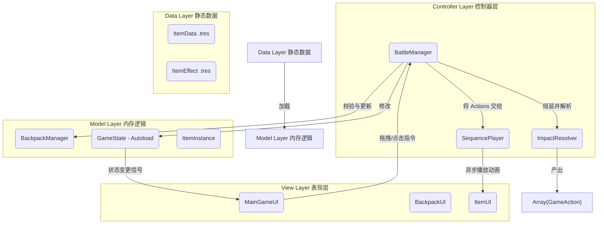
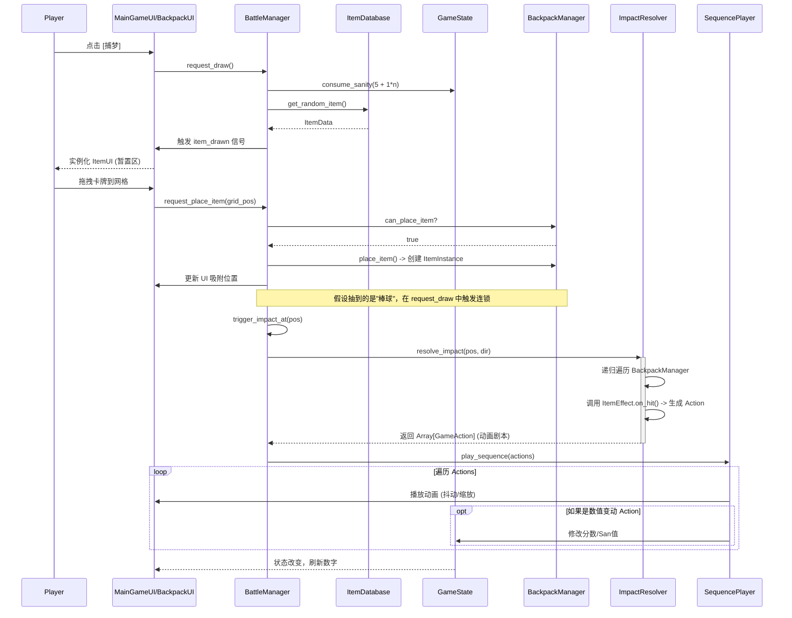

# 系统架构全景评审报告 (2026.05.08)

这是一次对《GoDotGame》现有系统架构的全面 Code Review 与架构梳理。

目前的架构设计非常符合 **MVC (Model-View-Controller)** 的思想，并且很好地运用了**数据驱动 (Data-Driven)** 和**全局解耦 (Autoload Bus)**，整体基底非常扎实。

---

## 一、 核心架构全景图 (Architecture Overview)

整个游戏可以分为四个主干层：

---

## 二、 核心子系统与职责 (Subsystems)

### 1. 控制中枢：`BattleManager`
*   **职责**：它是大脑。接收 UI 传来的点击和拖拽指令，调用数据层做判断，计算消耗，然后指挥表现层播放动画。
*   **核心接口**：
    *   `request_draw()`: 抽卡。处理阶梯式扣除 San 值，并生成物品。
    *   `request_place_item()`: 放置物品。仅负责放置逻辑，不自动触发撞击（与旧版本解耦）。
    *   `request_discard_item()`: 丢弃物品入垃圾桶。
    *   `trigger_impact_at()`: 从特定坐标发起撞击链结算。

### 2. 数据引擎：`BackpackManager` & `ImpactResolver`
*   **`BackpackManager`**：只管“数学和网格”。维护一个 5x5 的 `Dictionary`，里面装的是 `ItemInstance`（卡牌的运行时状态）。它判断会不会出界、有没有重叠。
*   **`ImpactResolver`**：物理与规则引擎。它不改变任何游戏状态，只是在瞬间“预演”一遍所有的连锁反应，然后把发生了什么包装成一叠厚厚的 `GameAction` 数组返回。

### 3. 全局单例与上下文：`GameState` & `GlobalEventBus` & `GameContext`
*   **`GameState`**：维护总分和 San 值的最终真相，当数值改变时向外广播。
*   **`GlobalEventBus`**：这是一个解耦神器。卡牌效果（比如“有人丢弃苹果时我加分”）不需要去遍历整个背包，只要监听总线的 `item_discarded` 信号即可。
*   **`GameContext`**：一个数据包，里面装了上面两个单例的指针。当 `ItemEffect` 需要生成动作时，通过这个包去获取状态。

---

## 三、 游戏循环与交互时机 (The Game Loop)

这是玩家在进行一次典型操作时，代码底层的流转过程。

---

## 四、 诊断结论与重构方向

目前的架构在“逻辑与表现完全解耦”上做得极好，但在支撑“污染流”（高频倍率叠加、状态附着）时存在以下断层，这也是接下来的重构方向：

1.  **Model 层的缺失 (ItemInstance 太单薄)**：
    *   目前 `ItemInstance` 仅包含 `(data, pos)`。污染流要求同一张卡在场上状态可变。必须引入 `current_pollution` 等状态变量。
2.  **Resolver 的线性局限**：
    *   目前 `ImpactResolver` 的管线是线性的触发 `on_hit`。需要将其升级为支持读取目标的污染层数 N，并以 N 为倍数触发 `on_hit`，同时反噬扣除玩家 N 点 San 值。
3.  **缺少空间扫描钩子**：
    *   目前的扫描逻辑仅支持直线查找。为了支持如“腐蚀海绵”、“剩饭盒”等卡牌，需要在 `BackpackManager` 中增加十字、九宫格、全场扫描等高级空间查询接口。