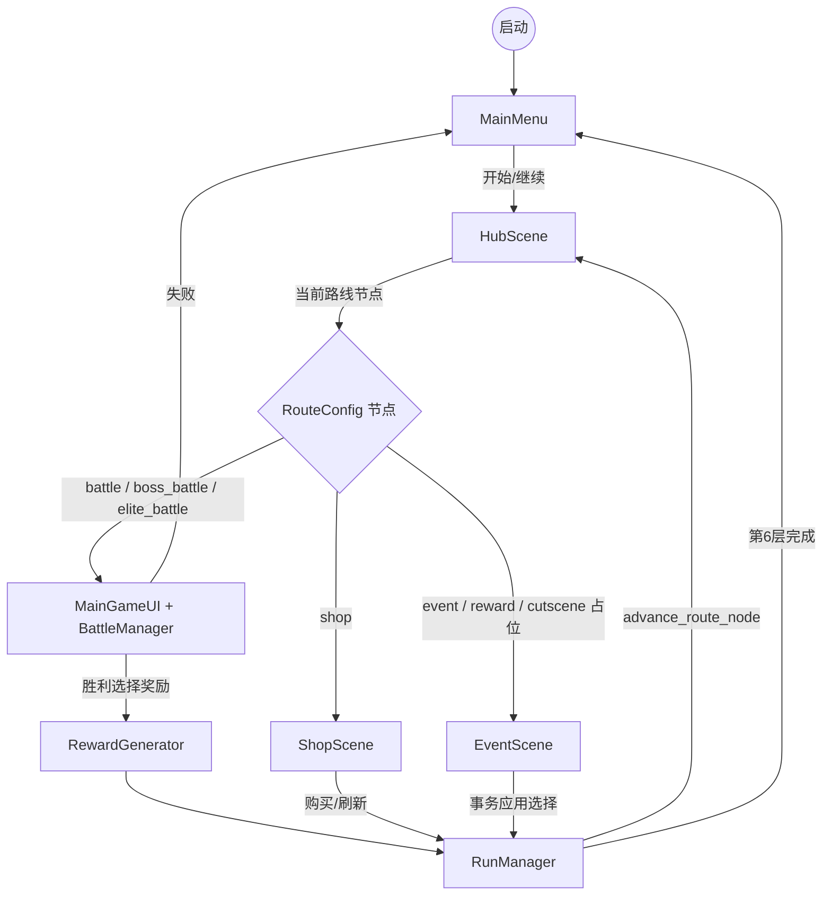
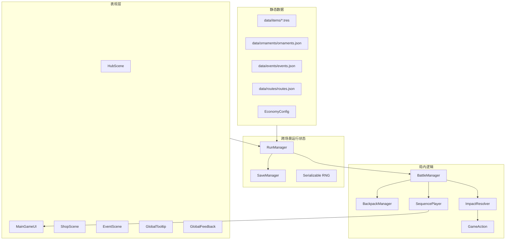
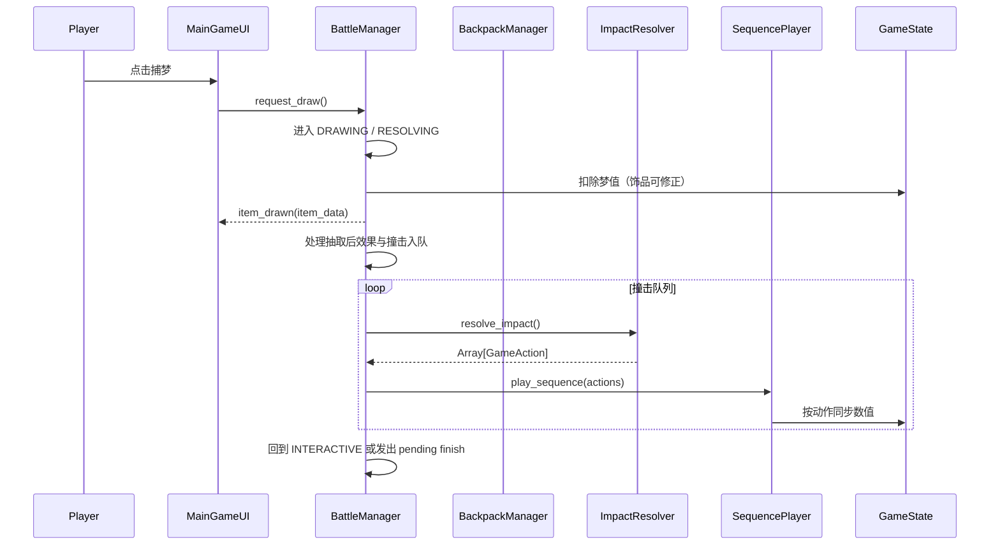
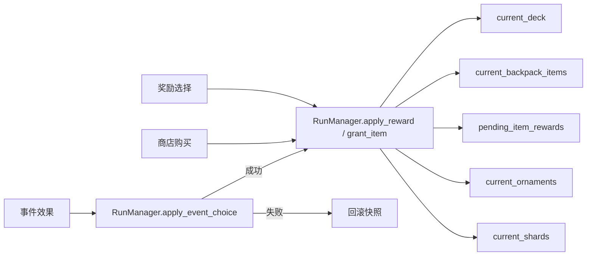
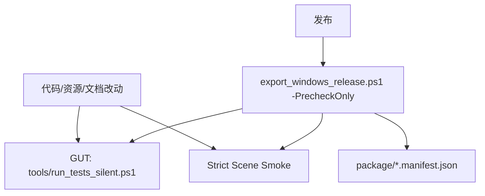

# 当前架构图记录

文档状态：已按当前代码更新。本文用于辅助理解，不替代 `../02_Tech/01_System_Architecture.md`。

## 一、运行主流程

## 二、核心分层

## 三、局内抽取与撞击

## 四、长期构筑写入

## 五、测试与发布

## 当前图中未覆盖的已知限制

- 整理背包当前复用局内 UI，存在视频反馈中的覆盖/层级问题。
- 道具系统暂缓，未进入运行图。
- GitHub Releases 自动发布尚未接入。
