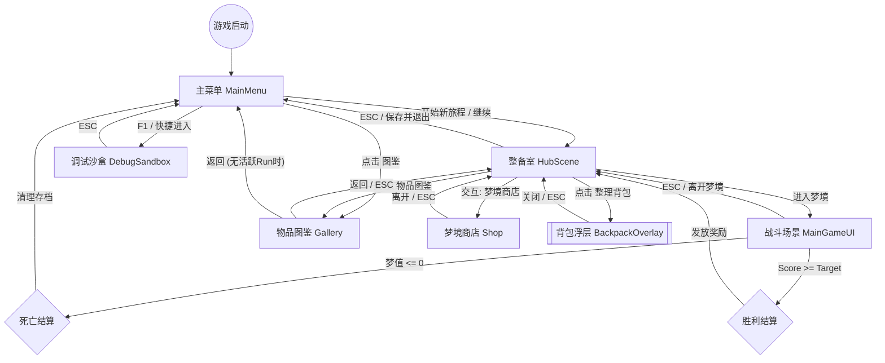

# 游戏场景切换逻辑架构图 (Scene Transition Architecture)

本文档描述了《GoDotGame》中不同游戏状态与场景之间的逻辑跳转关系，用于指导 UI 导航与玩家流程设计。

---

## 1. 核心流程图 (Flowchart)

---

## 2. 场景与浮层职责详解

### 2.1 主菜单 (Main Menu)
*   **功能**：存档检查、开启新梦境、继续旧梦境、进入全局图鉴。

### 2.2 整备室 (Hub Scene)
*   **核心功能**：战前整备、随机商店、物品图鉴、卡组管理。
*   **交互特点**：支持角色移动。通过 Overlay 模式实现无缝背包整理。

### 2.3 战斗场景 (Main Game UI)
*   **核心功能**：卡牌放置、连锁碰撞结算。
*   **逻辑转换**：胜利返回 Hub；失败退回主菜单。

### 2.4 辅助场景
*   **物品图鉴**：展示全物品数据。
*   **梦境商店**：消耗碎片购买新卡牌。
*   **调试沙盒**：开发者快速测试卡牌性能。

---

## 3. 状态持久化规则

1.  **局内进度**：当前深度、卡组。仅在当前 Run 进程中有效。
2.  **永久资产**：碎片总量、已解锁图鉴。永久保存。

---
*文档更新日期：2026年5月11日*
