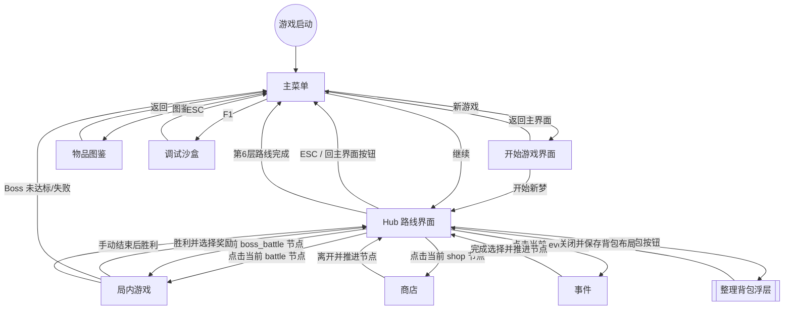
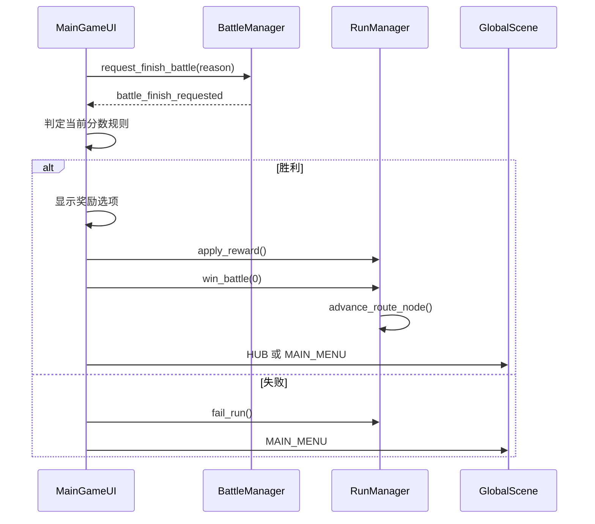

# 当前场景切换流程

文档状态：已按当前路线节点驱动流程更新。本文描述当前实现，不再采用旧的 Hub 自由入口流程作为主线。

## 1. 场景入口

`GlobalScene` 管理以下场景：

- `MAIN_MENU`：`res://src/ui/main_menu/main_menu.tscn`
- `NEW_GAME`：`res://src/ui/new_game/new_game_scene.tscn`
- `HUB`：`res://src/ui/hub/hub_scene.tscn`
- `BATTLE`：`res://src/ui/main_game_ui.tscn`
- `SHOP`：`res://src/ui/shop/shop_scene.tscn`
- `EVENT`：`res://src/ui/event/event_scene.tscn`
- `GALLERY`：`res://src/ui/gallery/gallery_scene.tscn`
- `DEBUG`：`res://src/ui/debug/debug_sandbox.tscn`

## 2. 当前主流程

## 3. 路线推进规则

- 路线由 `data/routes/routes.json` 定义，`RouteConfig` 负责加载和回退。
- Hub 会显示路线节点，但只有当前节点可进入。
- 进入节点前，角色会移动到对应节点位置。
- 战斗胜利、商店离开、事件选择完成后调用 `RunManager.advance_route_node()`。
- 当前层路线走完后进入下一层；第 6 层走完后 `run_finished(true)`，整局完成。
- 普通战斗默认无目标，结束即按通过处理。
- Boss 战必须检查目标分数，未完成则整局失败。

## 4. 战斗结束流

## 5. 商店与事件流

商店：

- 进入后读取当前节点缓存库存。
- 刷新会扣碎片并重新生成库存。
- 购买物品默认进入暂存区，购买饰品进入 `current_ornaments`。
- 离开商店时推进路线并回 Hub。

事件：

- 进入后按当前层、已见事件、权重和随机源选择事件。
- 有选择项时不能用 ESC 跳过。
- 高风险背包事件需要二次确认。
- 事件效果事务应用，失败则回滚。
- 成功后推进路线并回 Hub。

## 6. 整理背包浮层

当前整理背包由 Hub 复用 `main_game_ui.tscn` 打开，但会先调用 `configure_for_backpack_overlay()` 进入整理背包浮层模式。该模式会隐藏战斗专属元素，保持 `UI` 输入上下文，显示鼠标可点击关闭按钮，并在关闭时持久化背包布局后恢复 `WORLD`。

如果后续整理背包扩展出独立道具栏、排序、筛选或多页布局，再考虑拆成独立 `backpack_setup_scene`。

Hub 路线界面提供 `回主界面` 按钮；无浮层时按 ESC 也会直接返回主菜单。若整理背包浮层已打开，ESC 优先关闭并保存整理背包浮层，不触发主菜单跳转。

## 7. 输入上下文

`GlobalInput` 用于切换输入模式：

- `MENU`：主菜单。
- `WORLD`：Hub 路线和角色移动。
- `BATTLE`：局内交互。
- `UI`：商店、事件、设置、整理背包等 UI。
- `LOCKED`：转场、结算、动画或弹窗期间。

当前原则是尽量支持鼠标操作，键盘只作为辅助快捷操作。
